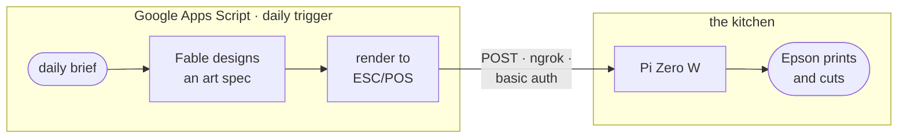
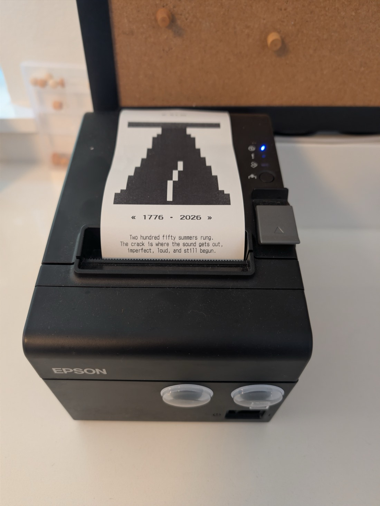

# morningprint

One original print, every morning.

A thermal receipt printer in my kitchen wakes up each day and prints a piece
of character art that has never existed before, designed seconds earlier by
Claude, themed to the day: the weather outside, the season, whatever the news
feels like. A short verse underneath. One physical copy, 80mm wide, and that
is the whole broadcast.

<p align="center">
  
</p>

Two mornings, a day apart. On July 3 the printer sent up one scout rocket to
test the dark, and the verse promised "tomorrow, the whole sky." On the Fourth
it kept the word: the same skyline under a sky full of bursts. Most days stand
on their own. Once in a while a piece answers the one before it.

This started as a bet against my phone. The first minutes of the day kept
going to feeds, so I pointed the same inputs at a printer instead. It reads
what the feeds read (headlines, forecasts, anniversaries) and hands back one
finished thing you can hold. There is nothing to refresh and nothing to
scroll; when the cutter drops, the day's edition is out. Yesterday's goes up
on the corkboard.

The whole thing is a Google Apps Script. There is no server to maintain beyond
a Raspberry Pi Zero W that pipes bytes into the printer's USB port.

## How it works



1. **Context.** `printDailyArt()` (`src/art.ts`) builds a small brief: today's
   date, the season, current weather from the Google Weather API, and a rolling
   archive of the last 14 pieces (title + one-line style note each).
2. **Design.** Claude gets a system prompt describing the medium (a 48-column
   monospace grid, 1-bit black, CP437 characters only) and is asked for one
   committed idea that differs sharply from everything in the archive. On a day
   that genuinely earns it (a holiday after its eve, an event still unfolding,
   a resonant anniversary) it may instead answer an earlier piece; the pair at
   the top of this page is one of those. It can run a few web searches to feel
   out the day. Structured output (a JSON schema) forces back a valid art
   spec: an array of styled text ops plus a short verse.
3. **Render.** A ~50-line renderer turns ops into raw ESC/POS bytes. No
   drivers, no images: the art is literally text with style commands.
4. **Print.** The bytes are POSTed to the Pi, which writes them to the
   printer's character device. The receipt prints: a small date stamp, the
   artwork, the verse. Nothing else: no title, no branding.

## The medium

A receipt printer is a surprisingly good canvas because it's so constrained:
203 dpi, one bit of color, 48 monospace columns, and a character set frozen
in 1981. Everything the model can do, it does with CP437:

| Trick               | How                                                         |
| ------------------- | ----------------------------------------------------------- |
| Tone / gradients    | `░ ▒ ▓ █` ramps across rows                                 |
| Sub-character edges | half-blocks `▀ ▄ ▌ ▐ ■` for silhouettes                     |
| Solid black fields  | inverted (white-on-black) runs; even spaces print solid     |
| Seamless shapes     | line spacing set to exactly one glyph height, so rows tile  |
| Giant type          | independent width/height scaling, 1–8× each                 |
| Fine texture        | the printer's second font: 9×17 glyphs, 64 columns          |
| Structure           | full single/double box drawing, `° · ∙ ≈ ∞ π Σ` and friends |

The "seamless shapes" row is the trick that makes block art possible at all:
by default the printer leaves a white seam between text lines, but `ESC 3`
with the right value makes `░▒▓█` rows fuse into continuous fields. The value
was calibrated empirically with a built-in test page. That page, and every
other byte this project sends, is documented in
[`docs/escpos-protocol.md`](docs/escpos-protocol.md).

## The art spec

The model doesn't emit bytes; it emits a declarative spec the renderer
executes. Abbreviated:

```json
{
  "title": "GOLDEN RUN",
  "caption": "Test pattern: gradient, silhouette, invert, scale, texture.",
  "verse": "The mountains hold their breath;\nthe sun tries every shade of gray\nbefore committing to gold.",
  "style": "calibration plate; gradient + silhouette + type specimen",
  "continues": "",
  "ops": [
    { "text": "░░░░…\n▒▒▒▒…\n▓▓▓▓…", "gapless": true },
    { "text": " DAWN ", "width": 2, "height": 2, "bold": true, "invert": true },
    { "text": "every feature · one receipt", "font": "B", "align": "right" }
  ]
}
```

Only the artwork and the verse are printed. The rest are archive fields: they
land in the execution log and in a rolling `ART_HISTORY` property that the
next day's prompt receives as a list to differ from. That pressure keeps a
daily generative loop from collapsing into the same sunset every morning, and
the prompt pushes rotation across the whole space: landscapes, geometric
abstraction, pattern studies, giant-type posters, constellation maps, weather
glyphs, emblems, diagrams.

`continues` is the deliberate exception. It stays empty almost every day, but
when the day itself hands the model a thread (the Fourth of July arriving
after its eve, an event still unfolding, a tenth anniversary), the model may
build on one recent piece and record which. Those links show up as markers in
the history it reads on later days, and a fresh marker raises the bar for the
next one. That is what keeps continuations a surprise instead of a habit.

The renderer treats the spec as untrusted: sizes are clamped, rows are
truncated to the column budget, control characters are stripped, output is
capped at 150 rows (~45cm of paper), and anything CP437 can't print becomes a
visible-but-harmless `?`.

A few API notes, for the curious: the art spec comes back via structured
output (`output_config.format` with a JSON schema); web search runs as a
server-side tool, so the client just resumes on `stop_reason: "pause_turn"`;
and a server-side fallback re-serves the request with another model in the
unlikely event of a refusal. Details in `CLAUDE.md`.

## Hardware

- **Printer:** Epson TM-T20III, an 80mm ESC/POS thermal printer with an
  auto-cutter. Any ESC/POS printer with a CP437 code page should work after
  recalibrating the column constants (`node test-print.mjs ruler`).
- **Bridge:** Raspberry Pi Zero W running a ~40-line Python `http.server`
  that writes request bodies straight to `/dev/usb/lp0`, exposed through an
  ngrok static domain with basic auth, kept alive by systemd.

<p align="center">
  
</p>

The full byte-level protocol (every command, the CP437 mapping, the geometry
and calibration results) is specced in
[`docs/escpos-protocol.md`](docs/escpos-protocol.md). The Pi's setup,
maintenance, troubleshooting, and disaster recovery live in
[`docs/pi-print-server-runbook.md`](docs/pi-print-server-runbook.md).

## Contributing

Clone the repo, `npm install`, and start [Claude Code](https://claude.com/claude-code)
in the root; it picks up [`CLAUDE.md`](CLAUDE.md) automatically, which carries
the architecture, the deploy ritual, and the byte-level gotchas. You can iterate
on the renderer with no hardware at all: `node test-print.mjs art --dry` shows
the exact ESC/POS bytes a change produces. The longer version, including a good
first prompt to hand Claude, is in [`CONTRIBUTING.md`](CONTRIBUTING.md).

## Run your own

TypeScript under `src/` is the source of truth; esbuild bundles it to a single
`dist/main.gs`, which [`clasp`](https://github.com/google/clasp) pushes to Apps
Script.

```bash
npm install        # dev tooling: clasp, typescript, esbuild, prettier
npm run build      # tsc --noEmit + esbuild bundle -> dist/main.gs
npm run status     # list the files clasp would push (dry check)
npm run push       # build, then clasp push (uploads dist/)
```

The Apps Script web editor is a mirror, not a second source of truth: edit
locally and push. `npm run pull` fetches remote back down if the editor was
touched directly.

First-time setup on a new machine: `npx clasp login` (writes `~/.clasprc.json`),
then `npm run push`. The project is already bound via the committed
`.clasp.json`.

### Configuration

No secrets live in the repo. Runtime config is read from **Script Properties**
(Apps Script editor → Project Settings → Script Properties):

| Property          | Required | What it is                                      |
| ----------------- | -------- | ----------------------------------------------- |
| `PI_URL`          | yes      | ngrok HTTPS URL of the Pi print bridge          |
| `NGROK_USER`      | yes      | basic-auth username for the tunnel              |
| `NGROK_PASS`      | yes      | basic-auth password for the tunnel              |
| `ANTHROPIC_KEY`   | yes      | Anthropic API key (`claude-fable-5`)            |
| `EMAIL_ALERTS_TO` | no       | where failure alerts are emailed (rate-limited) |
| `GEMINI_KEY`      | no       | Google API key for the Weather API              |
| `LAT` / `LON`     | no       | location for weather context                    |

Weather is garnish, not a dependency: without `GEMINI_KEY`/`LAT`/`LON` the
art still prints, just uninformed about the sky.

State keys managed by the script itself (no setup): `LAST_ART_DATE` (one art
print per day), `ART_HISTORY` (the rolling archive fed back into the prompt,
with markers on pieces that continued an earlier one), and `LAST_ALERT_TIME`
(rate-limits alert emails).

### Trigger

One time-driven trigger on `printDailyArt` (Apps Script editor → Triggers). A
morning hour works well. An hourly trigger is also safe: `LAST_ART_DATE`
limits it to one print per day, and because the guard is only set on success,
extra runs double as retries after a failure.

`testDailyArt()` prints the golden test plate (no API call) to verify the
hardware path. Set `DRY_RUN = true` in `src/art.ts` to log specs instead of
printing.

### Local iteration

`test-print.mjs` sends ESC/POS straight to the Pi bridge (the same endpoint
Apps Script hits), so you can iterate without deploying or waiting on a
trigger. The `art` modes load the real builders from the built `dist/main.gs`,
so run `npm run build` first; the preview then matches production exactly.

```bash
cp .env.example .env            # then fill in PI_URL / NGROK_USER / NGROK_PASS
npm run build                   # needed for modes that load dist/main.gs
node test-print.mjs hello       # minimal "SYSTEM ONLINE" connectivity test
node test-print.mjs text "Hi"   # arbitrary text
node test-print.mjs ruler       # column + gapless-spacing calibration page
node test-print.mjs art         # golden art spec through the real renderer (no API)
node test-print.mjs art:live    # LIVE end-to-end art (ANTHROPIC_KEY in .env)
node test-print.mjs art --dry   # print the hex payload instead of sending
```

`.env` is gitignored; credentials never live in the repo. This script is local
only; it isn't bundled into `dist/` or pushed to Apps Script.

## Layout

```
src/
  appsscript.json   manifest (V8, America/Los_Angeles)
  escpos.ts         CMD command table, column constants, encodeCP437
  art.ts            the daily art job: prompt, schema, renderer, Anthropic client
  transport.ts      sendToPi (HTTP → Pi bridge), retries, alert emails
  weather.ts        Google Weather API fetcher (context for the prompt)
  main.ts           entry points re-exported for the build footer
build.js            esbuild bundle → dist/main.gs
test-print.mjs      local print harness (talks to the Pi directly)
docs/
  escpos-protocol.md         the full byte-level protocol spec
  pi-print-server-runbook.md the Pi side: setup, ops, troubleshooting
example/
  example_1.jpeg             the Liberty Bell piece, fresh off the printer
  example_2.jpeg             the Jul 3 -> Jul 4 sequence, pinned side by side
```

`npm run build` bundles `src/` into `dist/main.gs`; `clasp` uploads `dist/`
(`.clasp.json` → `"rootDir": "dist"`). `dist/` is gitignored.

## Provenance

A personal project by Matt Horn, developed on personal time using personal
equipment and personal accounts. Not affiliated with, sponsored by, or
endorsed by Google, Anthropic, or any past or present employer. Views and
content are my own. Copyright (c) 2026 Matt Horn. See [NOTICE](NOTICE).
